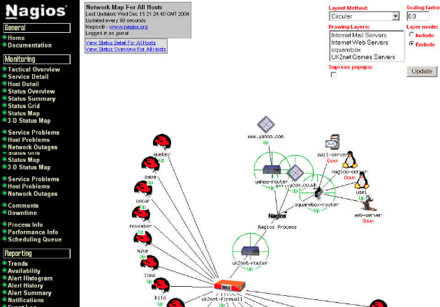

<div align="center">
    
# **NAGIOS**



</div>

# Índice
    
- [Introducción Nagios](#introducción-nagios)
  
- [Rutas importantes](#rutas-importantes)
  
- [Archivos importantes](#archivos-importantes)

- [Notificaciones](#notificaciones)

# Introducción Nagios
**Qué és y para qué sirve**

Nagios es una herramienta de monitorización de código abierto que permite supervisar sistemas, redes e infraestructuras de TI, alertando sobre problemas y fallos en tiempo real. 

Nagios viene con plugins ya instalados, pero la esencia es personalizarlo y poner lo que creamos necesarios.

Los checks permiten saber a Nagios si los host y servicios funcionan correctamente.

Los Host son los dispositivos que tienen IP y se conectan con Nagios para ser monitorizados.

# Rutas importantes

- /usr/local/nagios/etc
    - cgi.cfg -> Archivo de configuración de la web
    - nagios.cfg -> Arcivo de configuración motor de Nagios
    - resource.cfg (macros $ USERx $) -> Archivo definir macros de usuarios y contraseñas, especificar rutas de plugins
    - htpasswd.users -> Contiene la información de los usuarios y su contraseña cifrada

- /usr/local/nagios/etc/objects
    - localhost.cfg -> Archivo configuración del servidor de Nagios para automonitorizarse
    - commands.cfg -> Permite definir los comandos al hacer checks
    - contacts.cfg -> Definir y dar de alta contactos
    - timeperiods.cfg -> Configura la información sobre los periodos de tiempo que queremos que se ejecuten los checks

UDEMY SECCIÓN 3.11 PRÁCTICA

> :q! -> Salir sin guardar

# Archivos importantes

## Archivo nagios.cfg

Se van a guardar los logs
```
# Ruta archivo de log

log_file=/usr/local/nagios/var/nagios.log

# Directorio con archivos de objetos cfg para monitorizar

cfg_dir=/usr/local/nagios/etc/objects/RUTA

#Archivos importantes configuración

cfg_file=/usr/local/nagios/etc/objects/commands.cfg
cfg_file=/usr/local/nagios/etc/objects/contacts.cfg
cfg_file=/usr/local/nagios/etc/objects/timeperiods.cfg
cfg_file=/usr/local/nagios/etc/objects/templates.cfg
cfg_file=/usr/local/nagios/etc/objects/localhost.cfg

# Archivo configuración de recursos

resource_file=cfg_file=/usr/local/nagios/etc/resource.cfg

# Status file

status_file=cfg_file=/usr/local/nagios/var/status.dat

# Intervalo de tiempo en escribir en status.dat

status_update_interval=10

# Usuario y grupo SO

nagios_user=USUARIO
nagios_group=GRUPO

# usar syslog también con archivo de log

use_syslog=1

# Comandos externos por web a fichero

check_external_commands=1

#Checkeos pasivos

accept_passive_service_checks=1
accept_passive_host_checks=1

# Evitar o escapar caracteres especiales

illegal_object_name_chars=`~!$%^&*|'"<>?,()
illegal_macro_output_chars=`~$&|'"<>

# Formato fecha y hora

date_format=euro
use_timezone=Europe/Spain

```

## Archivo de Hosts

Dentro de la ruta /usr/local/nagios/etc/objects, creamos una carpeta donde vamos a meter los archivos con nuestros Host:

```
sudo mkdir NOMBRECARPETA
```
```
cd NOMBRECARPETA
```
```
sudo vim NOMBREHOST
```
```
 define host {
    parents                 SO
    host_name               NOMBREDISPOSITIVO
    address                 IP
    check_command           check-host-alive
    max_check_attempts      3
    check_interval          5
    retry_interval          1
    check_period            24x7
    #contacts                NOMBRECONTACTO
    #contact_groups          GRUPOCONTACTO
    notification_interval   120
    notification_period     24x7
    notifications_enabled   1
    icon_image              IMAGENINTERFAZ
    statusmap_image         IMAGENINTERFAZ
    register                1
}

```
Queremos que lo que hay en la carpeta que hemos creado, sea procesado por Nagios:
```
sudo vim /usr/local/nagios/etc/nagios.cfg
```
```
cfg_dir=/usr/local/nagios/etc/objects/CARPETACREADAHOST/NOMBREHOST1.CFG
```
> :wq -> para guardar y salir

> sudo systemctl restart nagios.service -> Reiniciar el servicio


# Notificaciones

## Notificaciones a Telegram
1. Buscamos BotFather
```
/newbot
```
2. Guardar el código para acceder por HTTP API
3. Crear un grupo
4. Meter el bot creado
5. Dar permisos al bot
6. Conectar nuestro Nagios por API
```
curl -LK -i -X GET https://api.telegram.org/botNUESTROCÓDIGOPASO2/getUpdates
```
7. Crear comando Telegram
```
sudo vim /usr/local/nagios/etc/objects/commands.cfg
```
```
# 'notify-host-by-telegram' command definition

define command{

command_name notify-host-by-telegram

command_line /usr/bin/curl -X POST --data chat_id=-NUESTROID --data parse_mode="markdown" --data text="%60$HOSTNAME$%60 %0A%0A$NOTIFICATIONTYPE$ %0A%60$HOSTSTATE$%60 %0A%60$HOSTADDRESS$%60 %0A%60$HOSTOUTPUT$%60" https://api.telegram.org/botNUESTROCÓDIGOPASO2/sendMessage

}

# 'notify-service-by-telegram' command definition

define command{

command_name notify-service-by-telegram

command_line /usr/bin/curl -X POST --data chat_id=-NUESTROID --data parse_mode="markdown" --data text="%60$HOSTNAME$%60 %0A%0A$NOTIFICATIONTYPE$ %0A%60$SERVICEDESC$%60 %0A%60$HOSTADDRESS$%60 %0A%60$SERVICESTATE$%60 %0A%60$SERVICEOUTPUT$%60" https://api.telegram.org/botNUESTROCÓDIGOPASO2/sendMessage

}
```
8. Definir contacto
```
sudo vim /usr/local/nagios/etc/objects/contacts.cfg
```
```
define contact{

contact_name                    NOMBRE
host_notifications_enabled      1
service_notifications_enable    1
service_notifications_period    24x7
host_notifications_period       24x7
service_notifications_options   w,u,c,r,f,s
host_notifications_options      d,u,r,f,s
service_notifications_commands  notify-service-by-email,notify-service-by-telegram
host_notifications_commands     notify-service-by-email,notify-service-by-telegram
email                           GMAIL
pager                           IDTELEGRAM
}
```
9. Reiniciamos el servivio de Nagios
```
sudo systemctl restart nagios
```

